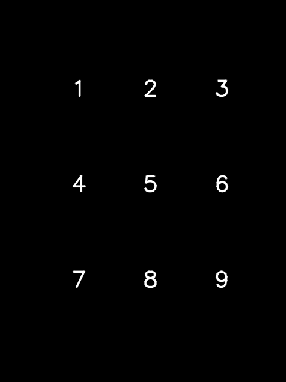

# Quarto

## How to use

`roslaunch quarto_launcher make_img.launch`

を使って, `config` 内に `img file` を作成します.

`roslaunch quarto_launcher`

[comment]:[image]:(./quarto_description/config/img/pin_img.png)
